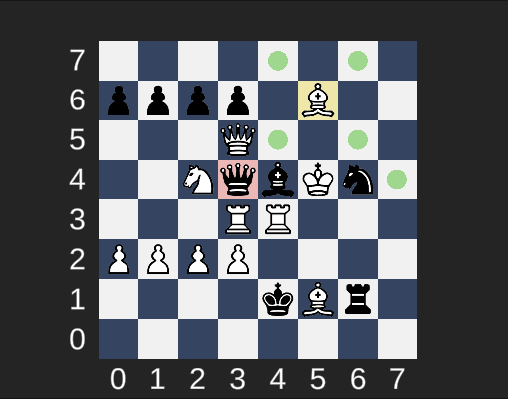

# Chess Board Piece Placement 

## Solution Description

Unity Version: 2020.3.48f1 

### All base requirements are met and checked. 

**Missing:**
 - Player Color Choice Hardcoded as white
 - Some moves are illegal: king can get checked 

 - Pawn: 
    - First move -> 2 steps
    - En Passant
    - Rank Up 

- King/Rook: 
    - Castling

- Check: 
    - Protection and King Movement logic

- Black Pieces selection and hilighting

[Out of Scope]
**Bug:**
- Currently all pieces are highlighted when can be captured. 

[ note: made some contrast changes for visiblity - personal preference]